# Eloge de la fuite

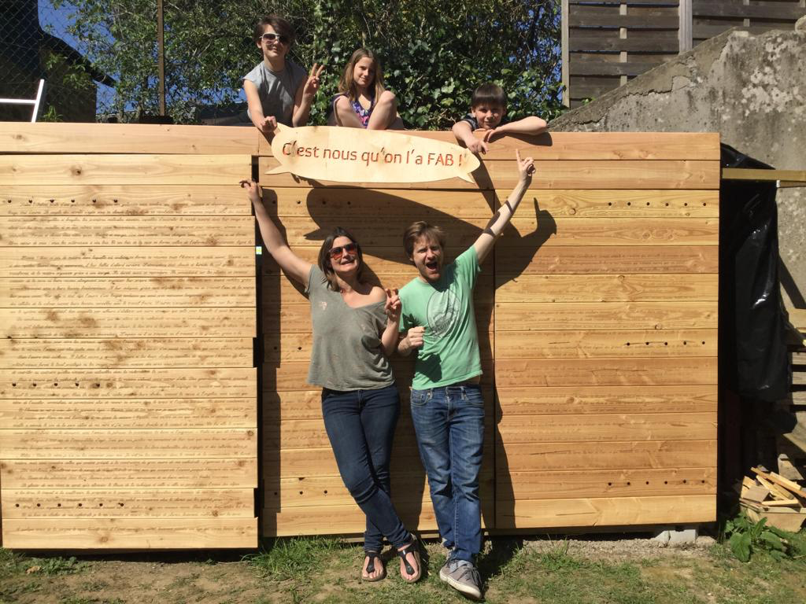

# Réalisé à [la fabrique du loch](https://www.lafabriqueduloch.org/fr/accueil/)

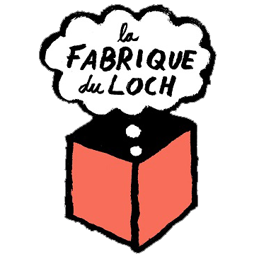

## Ressources

Site web de polices "one line": https://www.onelinefonts.com

La police utilisée est: [OLF Script](https://www.onelinefonts.com/index.php?main_page=product_info&cPath=124_94&products_id=197&zenid=7op7qtn2ala9djji0e1st3l260)

[Modèle 3d .. approché](./ResourcesEloge/Modele3DNX/Assemblage.zip)

[Fichiers Inkscape](./ResourcesEloge/Inkscape/Archive.zip)

## Un rapide historique en images

L'inspiration
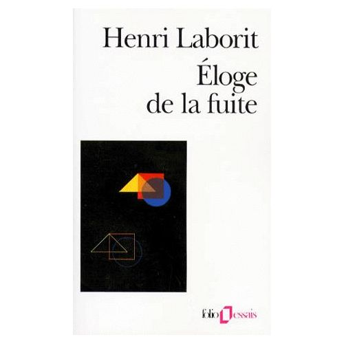

"Mise en planches" sur Inkscape

Essais de réglages
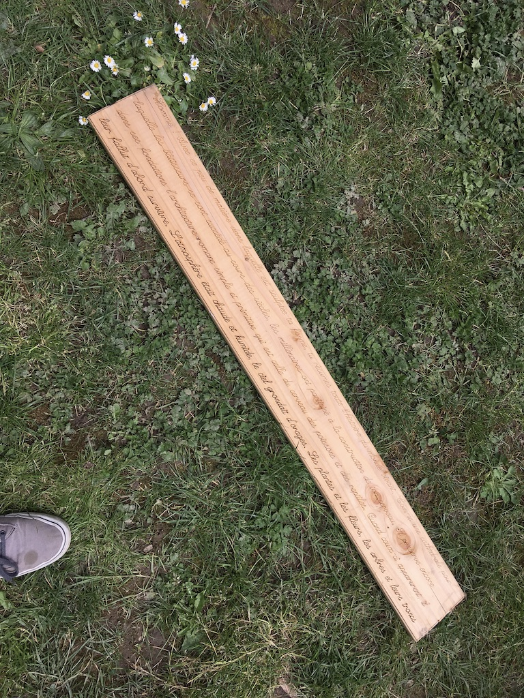

Planches gravées!
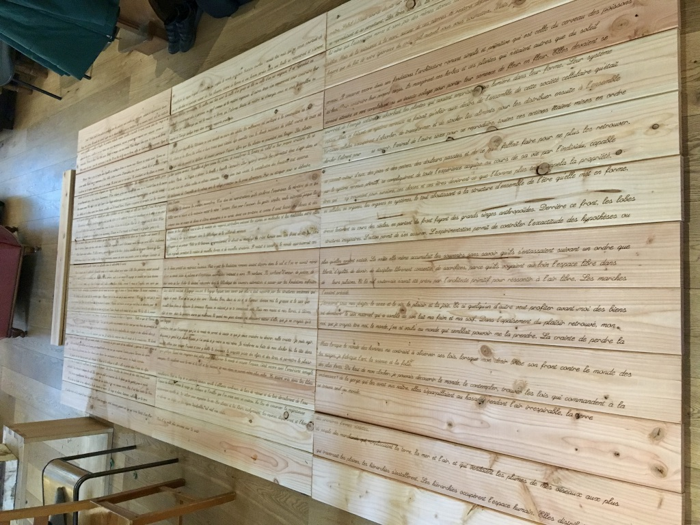

Préparation montage des portes
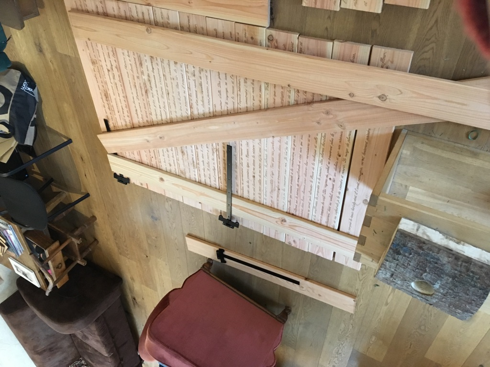

Une porte assemblée
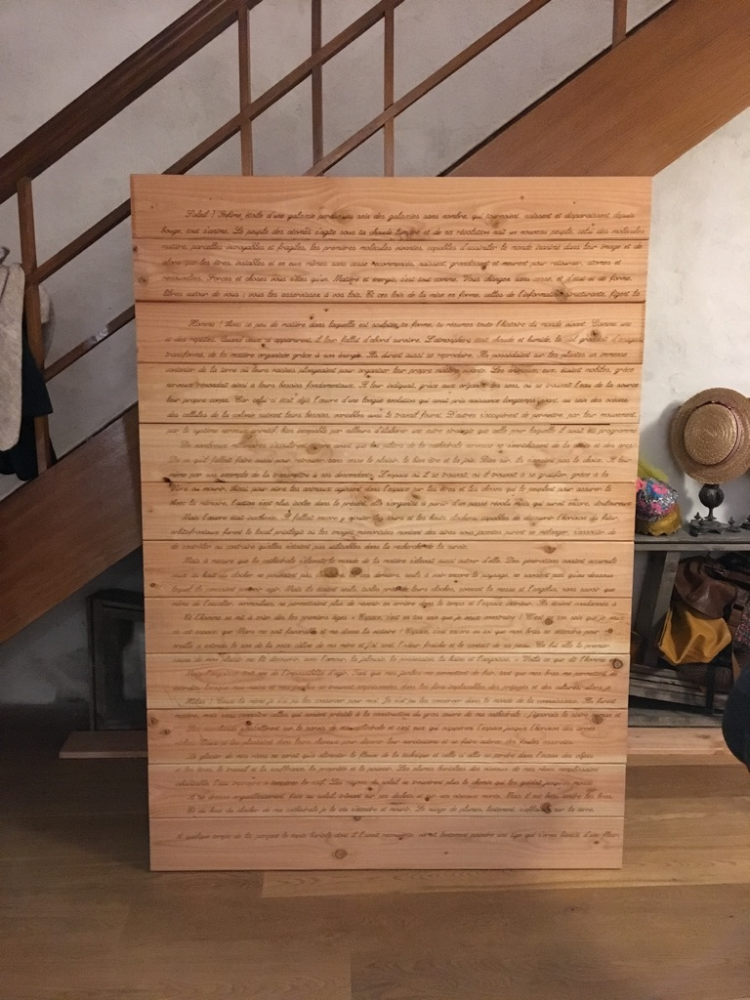

Trois portes assemblées... Une enfant inspirée

Les portes montées
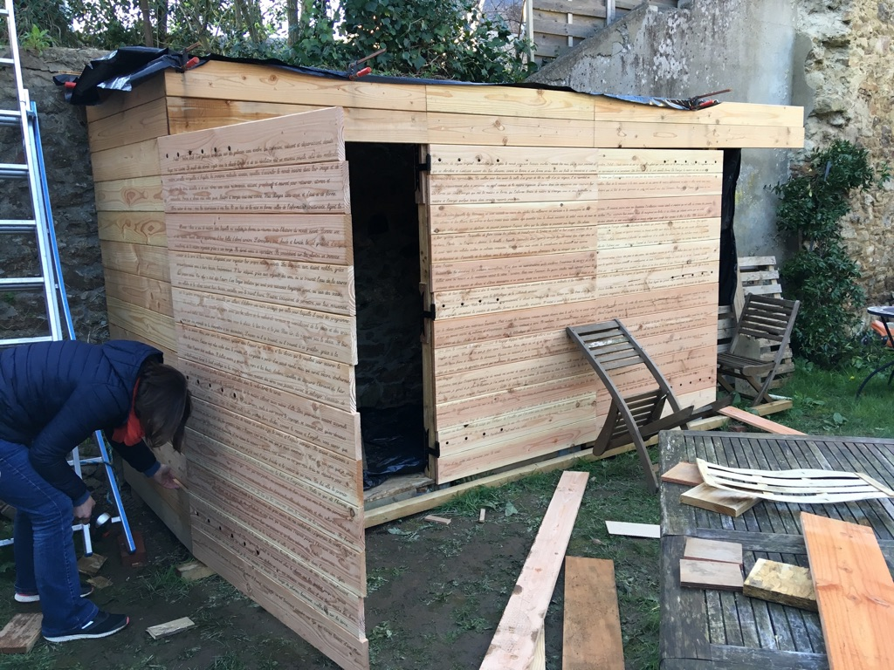

Gros plans
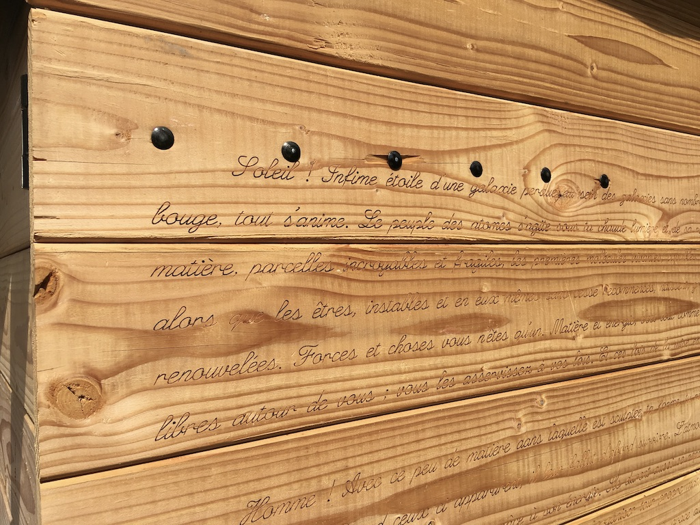

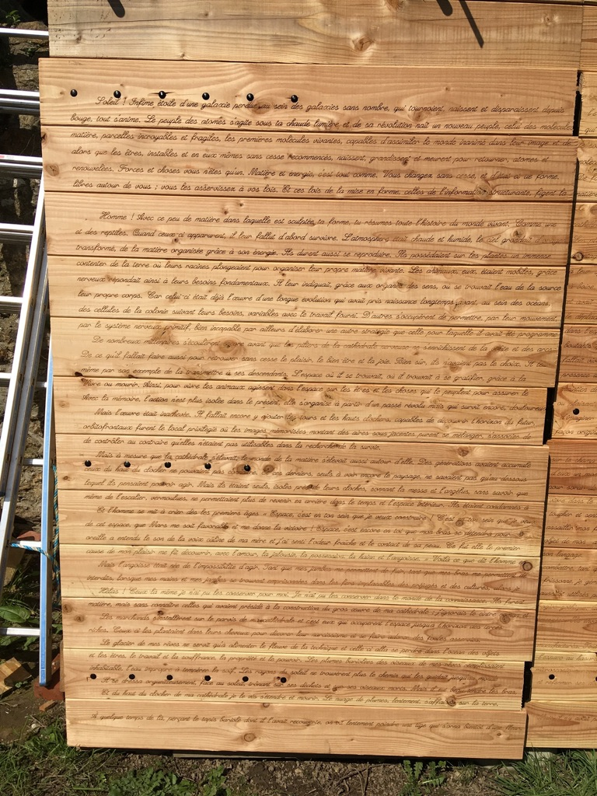

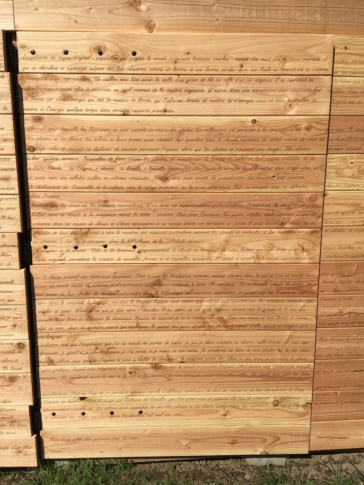

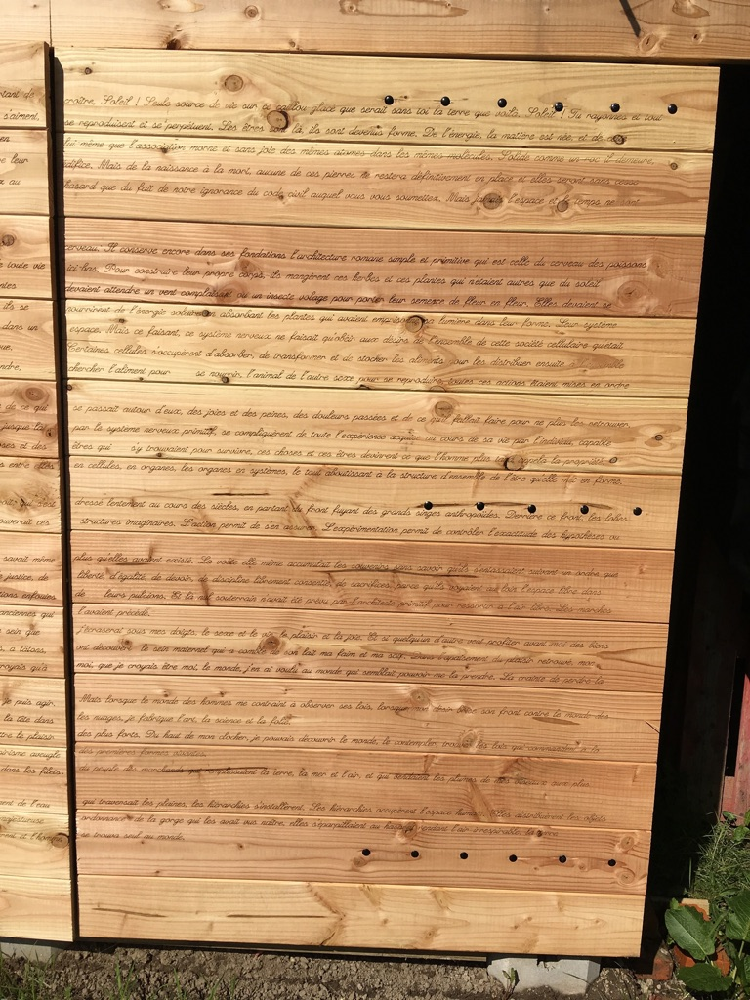

Vue d'ensemble :-)

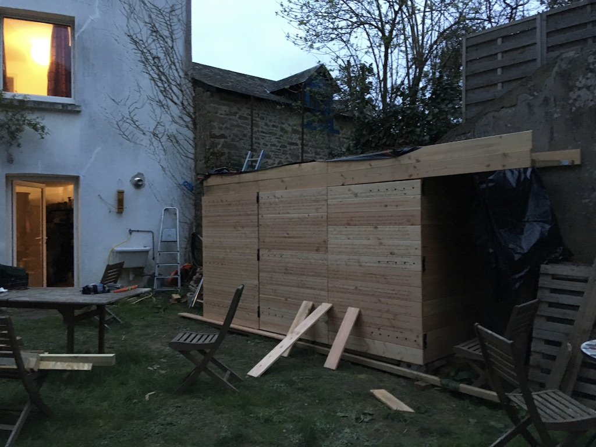

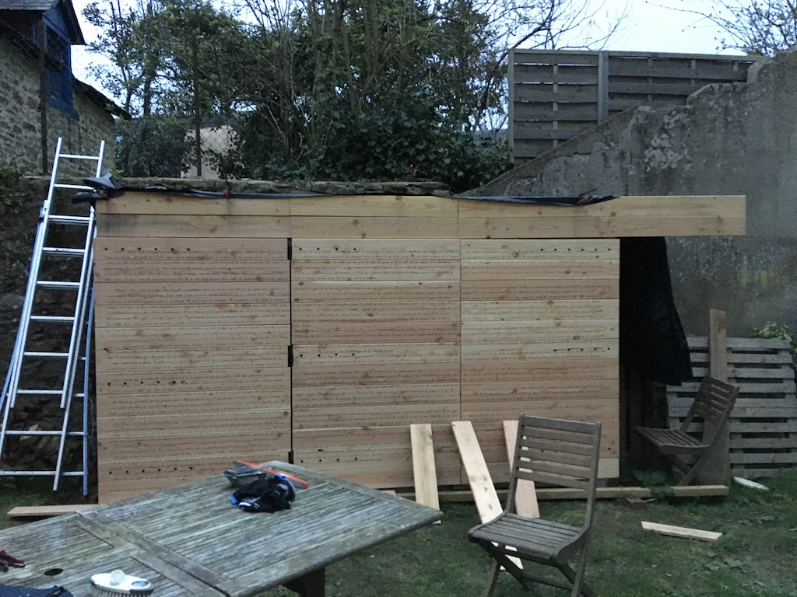

