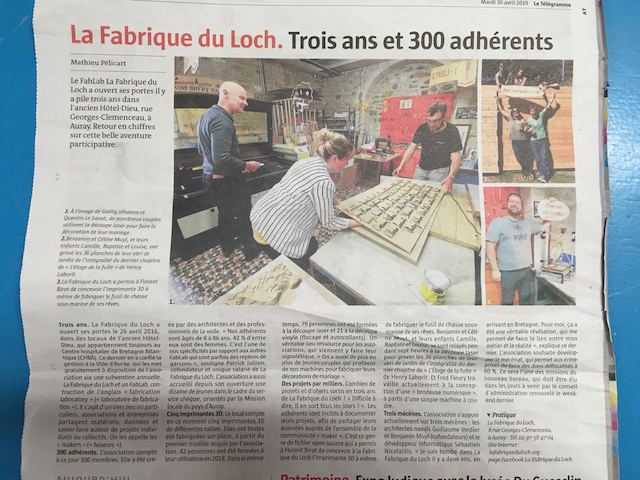

# Eloge de la fuite

# Réalisé à [la fabrique du loch](https://www.lafabriqueduloch.org/fr/accueil/)

## Ressources

Site web de polices "one line": https://www.onelinefonts.com

La police utilisée est: [OLF Script](https://www.onelinefonts.com/index.php?main_page=product_info&cPath=124_94&products_id=197&zenid=7op7qtn2ala9djji0e1st3l260)

[Modèle 3d .. approché](./ResourcesEloge/Modele3DNX/Assemblage.zip)

[Fichiers Inkscape](./ResourcesEloge/Inkscape/Archive.zip)

## Un rapide historique en images

L'inspiration

"Mise en planches" sur Inkscape

Essais de réglages

Planches gravées!

Préparation montage des portes

Une porte assemblée

Trois portes assemblées... Une enfant inspirée

Les portes montées

Gros plans

Vue d'ensemble :-)

